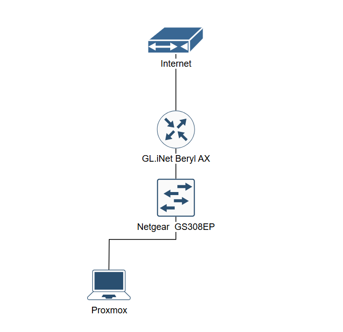

# 💻 Jake’s Home Lab
I am creating a cybersecurity &amp; networking home lab to experiment with different tools, set up a network for VMs, and gain hands on experience to gain important skills used in business.

## ⌨️ Overview
- Virtualization: Proxmox

## 🧭 Goals
- Learn enterprise-style networking and security
- Run a local SIEM (Wazuh/Splunk)
- Test Dockerized applications
- Practice incident response

## 📚 Contents
| Folder | Description |
|--------|--------------|
| `setup/` | Documentation for system and service setup |
| `hardware/` | Physical components and diagrams |
| `scripts/` | Automation and utility scripts |

## 🗺️ Architecture

