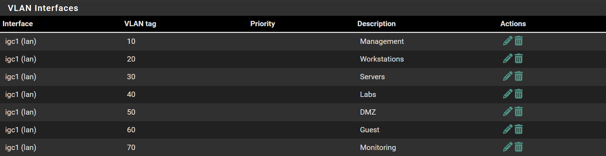

# VLAN Configuration

## Quick Access

[Return to Network Architecture Implementation](../setup/01-network_architecture_implementation.md)

## Create VLANs
```pfsense
Interfaces -> Assignments -> VLANs
```

1. Add new VLAN

2. Select your LAN

3. Provide a VLAN tag

4. Give the appropriate description: `Management`

5. Repeat for all VLANs

## Assign VLAN as Interface
```pfsense
Interfaces -> Assignments
```

1. Choose VLAN from `Available Network Ports:` 

2. Press `+Add`

3. Select the interface

4. Set the name / description: `VLAN10`

5. Set IPv4 Configuration Type: `Static IPv4`

6. Set the IPv4 address: `10.27.10.1/24`

### VLAN Config Screenshot

