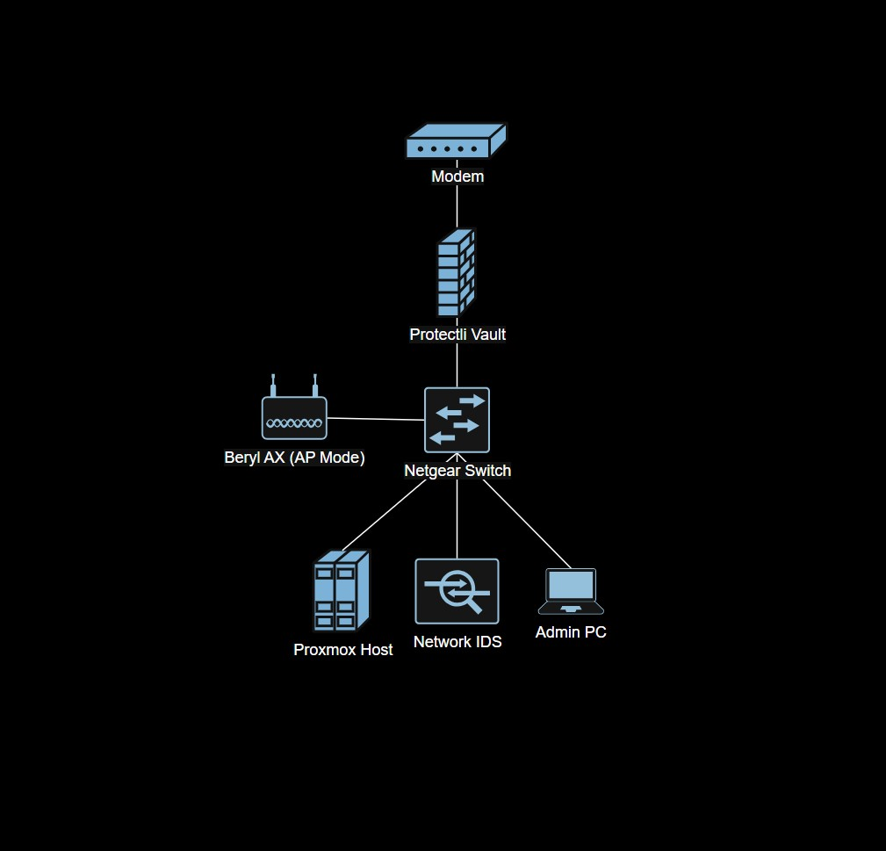

# 🏗️ 01 - Network Architecture (Implementation)

## Objective
Document the physical and logical network architecture implemented in Cyberlab v2, including devices used, physical connections, and network topology.

---

## Hardware

| Device | Purpose |
|--------|---------|
| Protectli Vault VP2440 | Firewall / Router |
| Netgear GS308EP | Managed Switch |
| Beryl AX | Router (AP Mode) |
| Proxmox Host | Virtualization Server |
| Dell Laptop | Admin PC |
| Raspberry Pi | IDS / Suricata |
| Modem | Internet Access |

---

## Physical Network Connections

| From | To | Notes |
|------|----|-------|
| Modem | Protectli WAN | Internet access |
| Protectli LAN | Switch Port 1 | Trunk / VLAN tagging |
| Beryl AX | Switch Port 2 | Access port |
| Proxmox Host | Switch port 3 | VLAN trunk |
| Admin PC | Switch port 4 | Temporary management |
| Raspberry Pi | Switch port 5 | IDS |

---

## Logical Network Design
| Network | VLAN | Subnet | Purpose |
|---------|------|--------|---------|
| Management | 10 | 10.27.10.0 | Firewall, Switch, Router, Proxmox, Admin access |
| Workstations | 20 | 10.27.20.0 | Normal users, primary internal network |
| Servers | 30 | 10.27.30.0 | AD, file servers, DNS, internal services |
| Lab | 40 | 10.27.40.0 | Kali, malware analysis, attack VMs |
| DMZ | 50 | 10.27.50.0 | Public-facing services |
| Guest | 60 | 10.27.60.0 | Guest internet access |
| Monitoring | 70 | 10.27.70.0 | IDS, Suricata, monitoring, logging |

---

## Network Diagram

---

## Steps taken

1. Connected Protectli Vault WAN interface to modem
2. Connected Protectli Vault LAN interface to Netgear switch port 1
3. Connected Beryl AX WAN interface to Netgear switch port 2
4. Connected Proxmox host to Netgear switch port 3
5. Connected Admin PC to switch port 4
6. Connected Raspberry Pi to switch port 5

---

## Verification

-

---

## Deviations From Original Plan

- 

---

## Notes & Observations

- Separating physical and logical connections and documentation made setup easier and future-proofs the network for when I add more
- Having a network diagram before configuration allowed for a smooth experience during setup
- Determining switch ports beforehand saved time and maintains a logical flow (prioritizes firewall in switch port 1)

---
